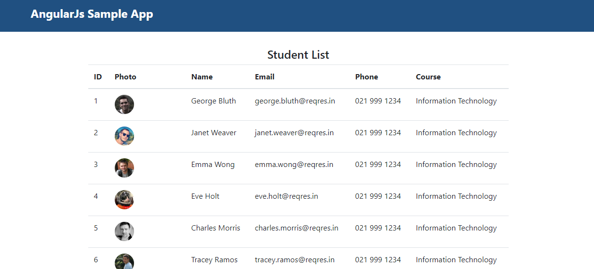

# Angular JS Sample Application





This project was generated with [Angular CLI](https://github.com/angular/angular-cli) 8.3.4.
It uses Angular 7 with Typescript, Material Design and Bootstrap


## Useful links for development

* [Angular 7 Documentation](https://v7.angular.io/docs)
* [Material Components for Angular 7](https://v7.material.angular.io/)
* [Material Icons](https://material.io/tools/icons/?style=baseline)

* [Angular 7 Tutorial](https://coursetro.com/posts/code/171/Angular-7-Tutorial---Learn-Angular-7-by-Example)
* [Consuming APIs in Angular: The Model-Adapter Pattern](https://blog.florimond.dev/consuming-apis-in-angular-the-model-adapter-pattern)

### Prerequisites

+ node.js v10

### Installing


1. Cloning the repository from Bitbucket.
```
   git clone https://uid@stash.auckland.ac.nz/scm/ft-3/angularjssample.git
```
2. Move directory.
```
   cd angularjssample/ng7-pre
```
3. Try following command.
```
   npm install 
```

### Running

1. Try following command.
```
   ng serve -o 
```
Access http://localhost:4200/ 


## Versioning

Version 1.0
